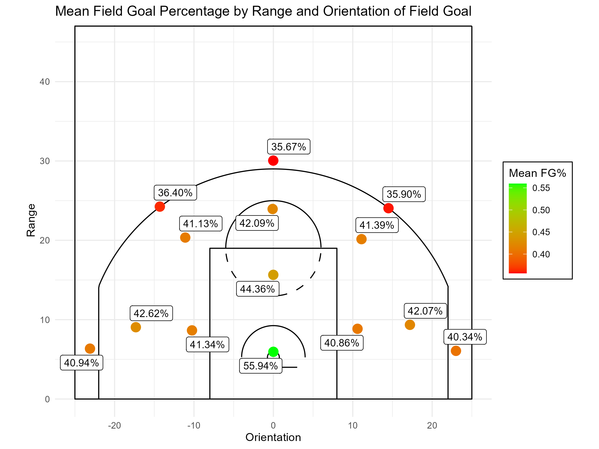

# Worth a Shot: NBA Shot Analysis (2003-2024)

## Introduction
This project uses data collected and organized by [Dom Samangy](https://github.com/DomSamangy/NBA_Shots_04_24). The data was used to analyze field goal percentages of 2- and 3-point field goals taken between 2003 and 2024 by first examining the change in points per game through out the years. Then examining the contribution that each type of field goal has towards points scored, and how the field goal percentages for each type of shot have changed over the years. Expected values are calculated from the field goal percentages for each type of shot, then binomial simulations are run using those field goal percentages to illustrate the distribution of potential points that could be scored shooting each type of field goal. Through exploratory data analysis, the field goal percentages were found to change not just year to year but also based upon the orientation and range of the field goal from the basket. New expected values were calculated and more binomial simulations were run with these new field goal percentages, revealing how shot selection can impact the potential points a player can score based on where the field goal is taken. Finally, scatterplots are made to examine the shift in shot selection from the 2003-04 season to the 2023-24 season.

The full report can be found inside of the [RMD file](WorthAShot.Rmd) or through the [rendered HTML](https://escotcarpenter.github.io/worth-a-shot-NBA-shot-analysis/WorthAShot.html).

## Findings and Visualizations
**From the NBA Lockout to 2023-24 Season:**
- The mean points per game has increased by 22%.
- The mean points scored by 3-point field goals has increased 102%.
- The mean 2-point field goal percentage has increased 6.6 percentage points.
- The mean 3-point field goal percentage has increased 7.2 percentage points.

**2- and 3-point field goal percentages change based on orientation and range from the basket.**
|  |  |
|----------------------------------------------|----------------------------------------------|

**Shot selection has changed from the early 2000s, having more emphasis on close to the basket shots and corner 3s.**
|  |  |
|----------------------------------------------|----------------------------------------------|

 
## Acknowledgements
[Dom Samangy](https://github.com/DomSamangy/NBA_Shots_04_24)
 
